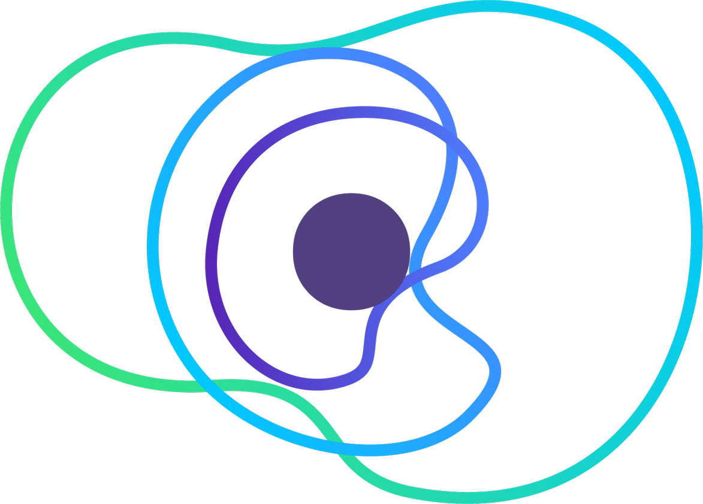

# Desafio Java Concrete

Propuesta al desafio tecnico Java Concrete.

# Servicio
- **URI-Local:** http://localhost:8080 
- **Base-Path:** /api/bff/mobile-team

# Swagger UI

el proyecto cuenta con [Swagger-UI](http://localhost:8080/api/bff/mobile-team/swagger-ui/index.html), ademas contiene una carpeta con un [archivo json](https://github.com/zcamles/java-recruiting-hsa/blob/master/postman/concrete.postman_collection.json) listo para cargar en [postman](https://www.postman.com/) y ejecutar las pruebas de postman.

# Docker 

Para utilizar la imagen de docker recomendamos utilizar el archivo de docker local, este funciona en dos etapas, la primera se encargara de realizar las pruebas y luego construir el proyecto, finalmente generara la etapa en la cual se ejecutara nuestro servicio.

para ello debes tener instalado docker en tu equipo
- [docker-windows](https://docs.docker.com/desktop/install/windows-install/)
- [docker-linux](https://docs.docker.com/desktop/install/mac-install/)
- [docker-mac](https://docs.docker.com/desktop/install/linux-install/)

si ya cumples con lo anterior, a continuacion esta la lista de comandos que debes utilizar:

**Construir la imagen**

para construir la imagen en base a nuestro archivo recomendado debes usar el siguiente comando:
- `docker build --rm -t concrete-image --progress plain --file docker/local/Dockerfile.local .`

**Ejecutar la imagen**

una vez construida la imagen, debemos ejecutarla, para ello usaremos el siguiente comando
- `docker run -it --rm -p 8080:8080 concrete-image`

ya realizados los pasos anteriores podras visualizar en tu consola los logs del aplicativo funcionando.

si quieres tomar control de la imagen generada puedes sobrescribir la entrada, de la siguiente forma:
- `docker run -it --rm -p 8080:8080 --entrypoint "/bin/sh" concrete-image`

**RECOMENDACION: utilizar docker-compose**

# Docker Compose
Nuestra recomendacion es utilizar docker-compose de esta forma se levanta junto al servicio todas sus dependencias externas, como por ejemplo base de datos entre otras.

Para ello necesitaremos hacer uso de dos comandos:
- `docker-compose build --progress plain --no-cache`
- `docker-compose up`

con el siguiente comando puedes eliminar lo generado con docker-compose:
- `docker-compose down`